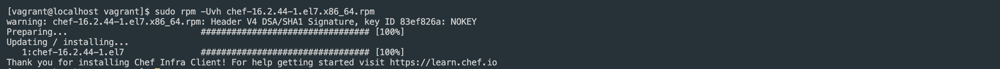
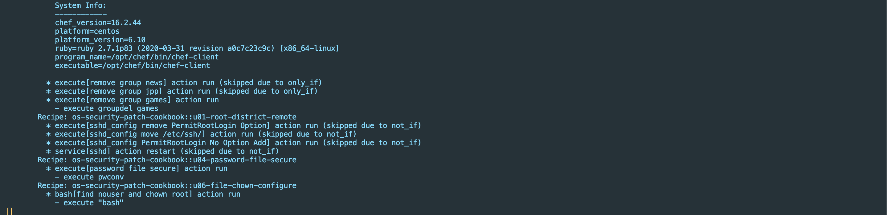
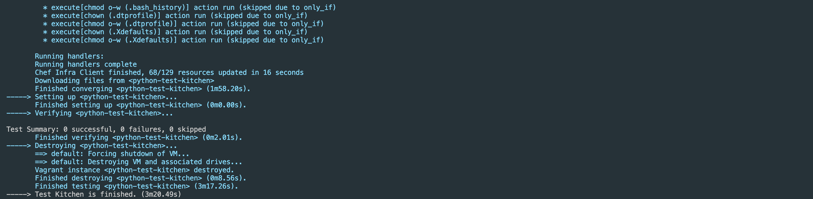

# os-security-patch-cookbook

Chef로 작성된 KISA 가이드 기반 보안 취약성 패치 스크립트입니다.

## 지원 범위
| 운영체제 | 지원여부 | 비고 |
|:--------|:--------:|:--------|
| CentOS 6 | 지원 | - |
| CentOS 7 | 지원 X | 지원 예정 |

## 사용 방법
---
#### 1. Chef 패키지 설치
<details>
  <summary>Click to expand!</summary>

  1. Chef 패키지 다운로드   
    - 다운로드 (https://downloads.chef.io/chef/)
      - 사용 중인 운영체제에 맞게 패키지 다운로드 받아 설치
  2. 다운받은 패키지 설치
      - 예시 (CentOS7 rpm 패키지 설치)
        - 다운로드 파일 (chef-16.2.44-1.el7.x86_64.rpm)
        - 설치
          ``` bash
          rpm -Uvh chef-16.2.44-1.el7.x86_64.rpm
          ```
          
</details>


#### 2. launch.sh 스크립트 실행
- 스크립트 실행 명령
  ``` bash
  ./launch.sh
  ```


## 테스트 방법
---
#### 1. Chef Development Kit 설치
#### 2. Kitchen Test 실행
  ``` bash
  kitchen test
  ```
  - 과정
    
  - 정상 종료
    